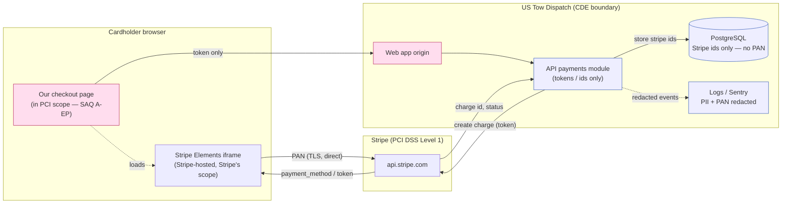

# PCI DSS — Cardholder Data Flow & CDE Boundary

The PAN is entered into a Stripe-hosted iframe and never crosses our boundary.
We exchange a client-side token for a charge; only Stripe identifiers are stored.

**Reading the diagram**

- The **red** nodes (our checkout page, web origin) are in PCI scope under
  SAQ A-EP — they deliver the page that loads Stripe's element.
- The PAN travels on the **solid cardholder→Stripe edge only**. It never touches
  the blue (our backend) nodes.
- Everything we persist or log is a Stripe identifier or redacted metadata,
  enforced by `verify-stripe-only.ts` and `verify-no-pan-logs.ts`.
